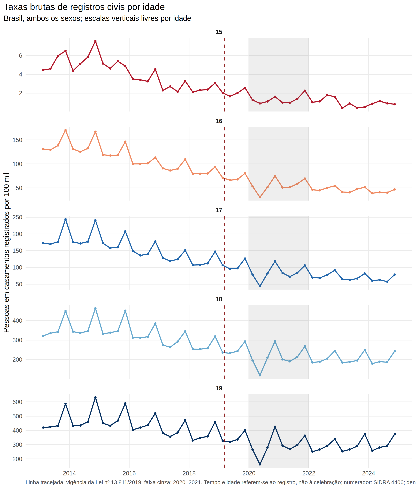
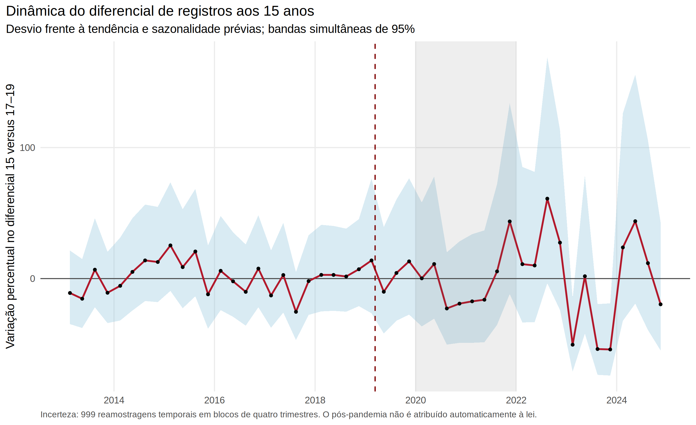
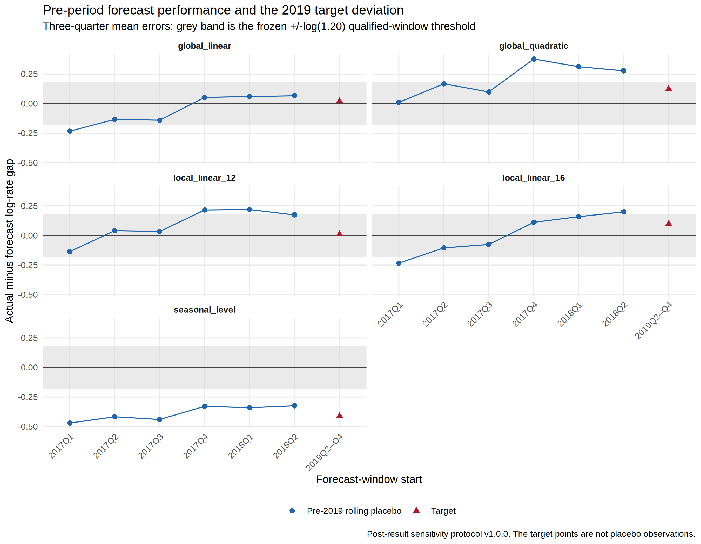
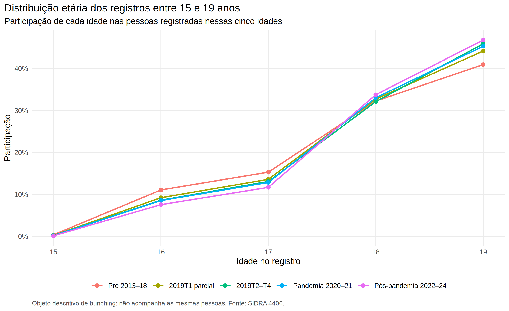
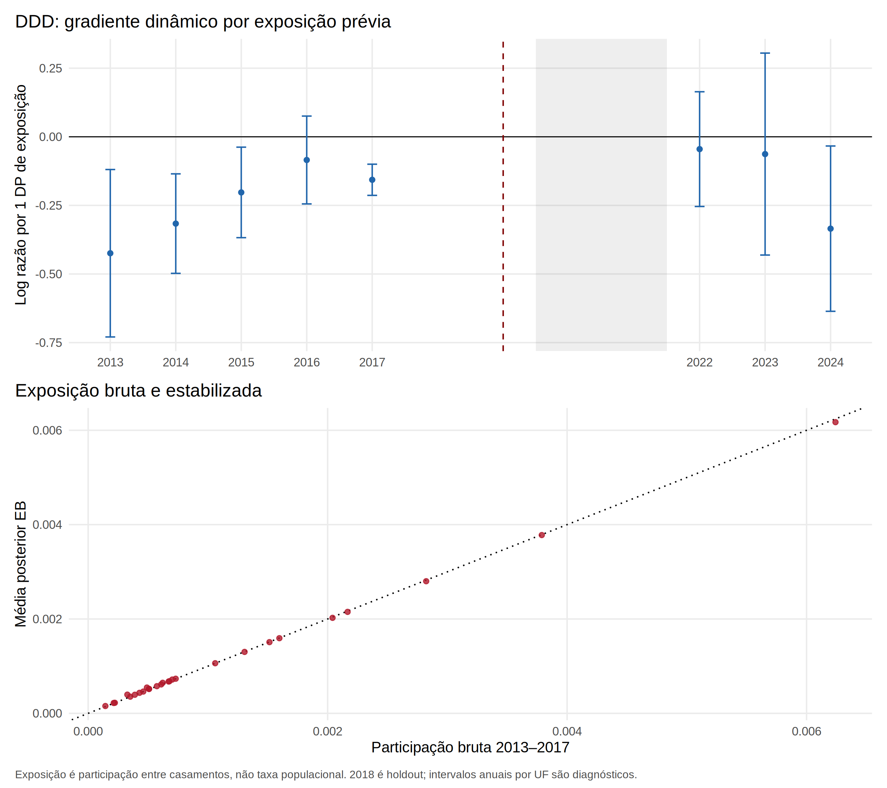
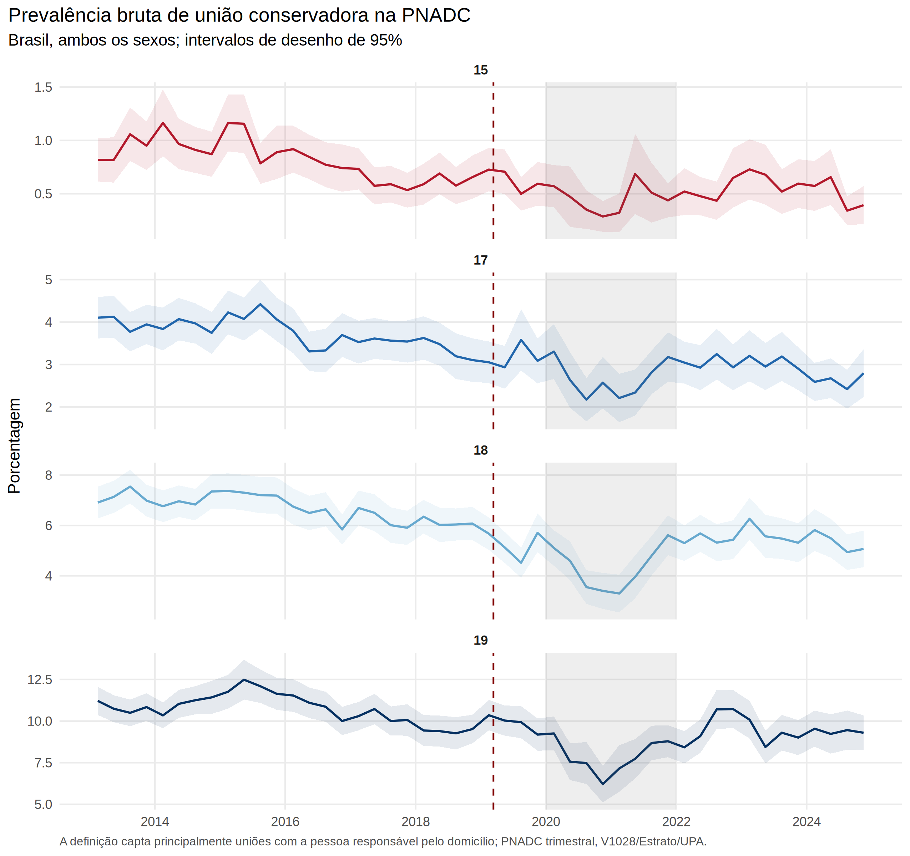
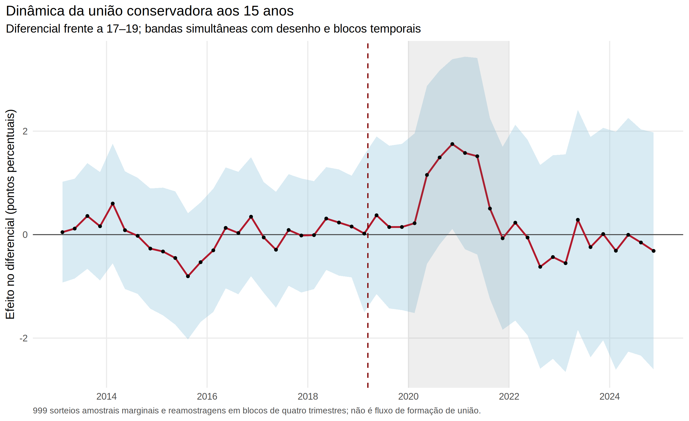

# Relatório técnico — avaliação empírica da Lei nº 13.811/2019

**Versão reproduzível gerada em:** 2026-09-02T14:09:10-0300  
**Estimando principal:** pessoas de 15 anos em casamentos civis registrados por 100 mil residentes de 15 anos  
**Desenho:** diferenças-em-diferenças por elegibilidade etária, não RD convencional  
**Especificação congelada antes dos efeitos:** `config/specification_lock.yml`

## 1. Resposta curta e limites da conclusão

Na especificação primária congelada — idade 15 versus 17–19, regiões, trimestres, PPML com offset populacional, efeitos fixos, sazonalidade e tendências lineares específicas por idade — a estimativa para 2019T2–T4 foi **-1,1%**, IC95% [-14,9%; 14,9%], p=0,888. Em níveis, isso corresponde a -0,022 pessoa por 100 mil e a 2,1 registros previstos evitados, IC95% [-25,2; 33,8].

Esse resultado **não demonstra uma redução causal adicional** nos registros aos 15 anos no curto prazo: o intervalo admite queda relevante e aumento relevante. Tampouco demonstra ausência de efeito. A série já caía antes da lei, e a versão obrigatória sem tendências estima -37,8%, mostrando dependência material da especificação.

Uma extensão rolling-origin, congelada como protocolo pós-resultado antes de suas próprias estimativas, não valida nenhum dos cinco contrafactuais. O global linear tem o menor RMSE pré-2019 (0,131) e estima 2,0% (intervalo de forecast [-17,6%; 23,4%]); o ensemble fixo estima 3,0%. A faixa de pontos [-33,7%; 12,8%] é envelope de especificações, não bound causal. O intervalo do modelo sazonal [-54,7%; -0,3%] inclui queda de 49%.

A PNADC produz um ponto de **+0,399 ponto percentual** na prevalência conservadora de união corresidente aos 15 anos, IC95% [-0,003; 0,801] p.p., p=0,052. O intervalo quase toca zero, o teste de equivalência a ±0,50 p.p. falha (p TOST=0,311) e o MDE é 0,575 p.p. Logo, há evidência apenas **sugestiva**, não conclusiva, de maior união corresidente relativa; não se prova informalização nem redução da formação de uniões.

As quatro afirmações substantivas permanecem separadas:

1. **Registros civis abaixo de 16 caíram em termos descritivos.** Isso já ocorria antes de 2019; o contraste causal aos 15 anos não identifica queda adicional robusta.
2. **Adiamento para 16–17 não foi estabelecido.** Os pontos são positivos, mas imprecisos; a razão de recaptura é numericamente instável.
3. **Redução da formação de uniões não foi estabelecida.** A PNADC mede estoque corresidente limitado, não fluxo de formação.
4. **Deslocamento para informalidade não foi estabelecido.** O ponto positivo da PNADC é compatível com essa hipótese, mas a incerteza e a diferença de objetos impedem uma afirmação causal forte.

O Registro Civil mede fluxo de eventos formais; a PNADC mede estoque de pessoas em união corresidente. Os dois outcomes e seus coeficientes não são subtraídos nem tratados como a mesma variável.

## 2. Marco jurídico verificado

A [Lei nº 13.811, de 12 de março de 2019](https://www.planalto.gov.br/ccivil_03/_ato2019-2022/2019/lei/l13811.htm), publicada e vigente em 13 de março de 2019, alterou o art. 1.520 do Código Civil para suprimir as exceções ao casamento abaixo da idade núbil. A leitura conjunta dos arts. 1.517–1.520 do [Código Civil compilado](https://www.planalto.gov.br/ccivil_03/leis/2002/l10406compilada.htm) confirma que a lei não proibiu todo casamento abaixo de 18 anos: pessoas de 16 e 17 anos continuaram sujeitas à autorização dos pais ou representantes legais prevista no art. 1.517.

Consequentemente, o tratamento direto é idade inferior a 16 anos. Com idade observada apenas em anos completos/categorias, o estudo usa DiD por elegibilidade etária. Não se apresenta uma RD convencional.

## 3. Dados, auditoria e construção

O inventário contém **332 arquivos** de entrada/referência. A reconstrução oficial do Registro Civil usa a tabela 4406 do SIDRA para 2013–2024. A PNADC trimestral contém 48 trimestres, 24.704.364 pessoas-fonte e 2.432.627 adolescentes de 14–19 anos. Os ZIPs trimestrais somam 10,23 GB e poderiam expandir para 85,97 GB; foram lidos em streaming, sem expansão física dos TXT.

### 3.1 Registro Civil

A fonte é uma tabela agregada de frequências, não microdados individualizados. Foram preservadas células de casamento e células de pessoas-cônjuges sem replicar linhas. Cada cônjuge entra uma vez em sua célula idade × sexo; `affected_marriage` conta casamentos em que a menor idade é inferior a 16.

As 3.780 células locais idade-sexo e todos os totais locais verificáveis coincidiram exatamente com a reconstrução oficial. A documentação do [Registro Civil do IBGE](https://www.ibge.gov.br/estatisticas/sociais/populacao/9110-estatisticas-do-registro-civil.html?lang=pt-BR) e os [metadados da tabela 4406](https://sidra.ibge.gov.br/tabela/4406) estabelecem que idade e mês se referem ao **registro**, e a geografia ao cartório/lugar do registro. Não se dispõe do mês da ocorrência/celebração nem de residência comprovada.

### 3.2 PNADC e denominadores

O dicionário oficial específico do layout identificou V1028 como peso trimestral calibrado, Estrato e UPA como elementos do desenho, e as variáveis de idade, sexo e condição no domicílio. V1028 não foi dividido por quatro. A PNADC é tratada como repetição de cortes transversais; nenhum identificador de ordem da pessoa é usado como chave longitudinal.

A regra ex ante exigiu n não ponderado ≥30 e CV populacional ≤20% por célula, com pelo menos 95% das células aprovadas e CV máximo ≤35% para escolher a geografia. UF falhou pelo CV máximo de 71,2%; região passou em 100% das células, com máximo de 9,1%, e foi escolhida para a incidência. Brasil é sensibilidade. Para união rara, Brasil combinado é primário.

A definição conservadora de união vale um quando o adolescente é cônjuge/companheiro da pessoa responsável ou é responsável e há cônjuge/companheiro no domicílio. Ela não capta todas as uniões. A definição ampliada acrescenta pareamentos aninhados plausíveis e permanece uma robustez ambígua.

### 3.3 Compatibilidade e timing

O numerador é classificado pelo local de registro; o denominador, por residência. A agregação regional reduz, mas não elimina, a incompatibilidade. Resultados municipais foram bloqueados. A maior frequência comum válida é trimestral. 2019T1 foi omitido; pós integral começa em 2019T2. A análise mensal omite março e começa em abril, mas continua sendo mês de registro.

## 4. Estratégia de identificação e specification lock

O modelo primário estima contagens por PPML com log da população como offset. Inclui efeitos fixos região × idade, região × período e idade × trimestre sazonal, além de tendências lineares específicas por idade. O grupo tratado é idade 15 e os controles primários são 17–19. Os controles 18–19 e 16–17 foram congelados como robustez; o segundo conjunto pode estar contaminado por adiamento.

A reforma é nacional e única. As muitas células regionais não geram tratamentos independentes. A inferência principal agrupa por trimestre-período (27 clusters, apenas três períodos pós no curto prazo) e é triangulada com série agregada HAC, bootstrap temporal, placebos e agregações alternativas. O cluster bidimensional com somente cinco regiões exigiu ajuste para matriz semidefinida positiva e produziu erro-padrão implausivelmente pequeno; ele é diagnóstico e não sustenta a conclusão.

O lock foi criado em 2026-09-02T00:56:08-03:00, antes de qualquer coeficiente pós-reforma, e tem hashes SHA-256 registrados. Quatro emendas documentam apenas não identificação de bases saturadas e impossibilidade computacional do `svyglm` direto; nenhum sinal, magnitude ou significância motivou mudança.

## 5. Resultados do Registro Civil

### 5.1 Descrição e estimando principal

Casamentos com ao menos um cônjuge abaixo de 16 caíram de 1.093 em 2013 para 512 em 2018, 419 em 2019 e 193 em 2024. A queda prévia impede interpretar a simples diferença 2018–2019 como efeito causal.

Na categoria agregada abaixo de 15, os números foram 206 em 2018, 174 em 2019 e 85 em 2024. Reportam-se contagem e participação, nunca uma taxa com denominador 0–14 fabricado. No agregado, houve 1.053.467 casamentos em 2018 (511,7 por 100 mil), 1.024.676 em 2019 (494,5 por 100 mil) e 948.925 em 2024 (447,9 por 100 mil). Essa taxa total é descritiva e mecanicamente muito diluída.

O estimando primário usa 540 células, cinco regiões e 27 trimestres. Houve 194 pessoas de 15 anos registradas nas células tratadas de 2019T2–T4. A razão de taxas foi 0,989 (IC95% 0,851–1,149).





### 5.2 Inferência, pré-tendências e potência

A série agregada HAC estima 2,0% (p=0,785) e o forecast com bootstrap temporal, 2,0% (p=0,857). Esses métodos não reproduzem exatamente o PPML regional, mas confirmam que a inferência temporal é ampla.

O teste conjunto de 24 leads tem p=0,161, porém nenhuma banda simultânea ficou inteiramente dentro do limite econômico de ±10%. Não rejeitar o teste não comprova tendências paralelas. Entre as datas placebo, 2015T2 apresentou efeito negativo (p=0,002), e a randomization inference com só quatro datas tem p=1,00 e resolução muito baixa.

O MDE de 80% é uma queda de 19,3%. A potência aproximada é 28% para queda de 10% e 83% para queda de 20%. Portanto, efeitos modestos permanecem difíceis de detectar.

### 5.3 Robustez e heterogeneidade

A versão sem tendência encontra -37,8% (p<0,001), contra -1,1% no modelo congelado. A análise mensal com tendência encontra -2,4% (p=0,820). As janelas pré iniciadas em 2013, 2014 e 2015 produzem, respectivamente, -1,1%, 8,2%, 11,1%.

No protocolo rolling-origin, os cinco modelos recebem tier `fail`. O RMSE varia de 0,131 a 0,391; a faixa dos pontos pós é [-33,7%; 12,8%]. A falha da calibração impede transformar o modelo de menor RMSE ou o ensemble em contrafactual validado.



A incerteza marginal do denominador em 499 sorteios tem DP 0,014 na escala log, menor que o erro-padrão temporal primário, mas a covariância completa entre células não estava disponível. O controle sintético pré-2019 colocou peso 100,0% na idade 17 e estimou lacuna curta de -0,658 por 100 mil; isso é robustez descritiva, não nova identificação.

Por sexo, o ponto feminino é -9,7% (p ajustado Holm=0,125) e o masculino é +155,8% (p ajustado Holm<0,001). O segundo é instável: há 36 células masculinas com zero e o nível basal é raro. A heterogeneidade não deve substituir o estimando combinado.

## 6. Adiamento, bunching e recaptura

Os efeitos curtos estimados foram +0,6% aos 16 (p Holm=1,000), +3,3% aos 17 (p Holm=0,311), +0,8% aos 18 e -2,4% aos 19. Nenhum contraste 16–19 sobrevive à correção familiar.

O déficit pontual aos 15 foi apenas 2,1 eventos, enquanto o excesso estimado aos 16–17 foi 367,4. A recaptura agregada pontual de 174,8 tem IC95% [-113,8; 1.107,2] e só 50,5% dos sorteios definem o denominador. Ela é não informativa e não acompanha pessoas.



## 7. Exposição prévia e DDD complementar

A exposição é a participação de casamentos com alguém abaixo de 16 entre todos os casamentos de 2013–2017, não uma taxa populacional. O gradiente EB por um desvio-padrão prévio é +9,9% (IC95% na escala log [-0,096; 0,285], p=0,332).

A correlação entre exposição e mudança no holdout de 2018 é -0,618, sinalizando regressão à média/tendências diferenciais. A DDD não identifica o efeito nacional médio.



## 8. PNADC: união corresidente

A análise primária de células combina 1.058.334 observações não ponderadas nas idades 15 e 17–19. Destas, 268.754 têm 15 anos, com 2.470 casos conservadores; em 2019T2–T4 são 26.093 pessoas e 186 casos.

O modelo de células estima +0,399 p.p. A série agregada HAC estima +0,235 p.p., IC95% [-0,100; 0,569] p.p.; o forecast temporal/desenho estima +0,223 p.p., IC95% [-0,542; 1,026] p.p.

No microdado, a LPM com clusters domicílio-período estima +0,344 p.p., IC95% [-0,119; 0,807] p.p.; a variância Taylor Estrato/UPA estima o mesmo ponto e IC95% [-0,025; 0,712] p.p. A união ampliada estima +0,597 p.p., p=0,102.

A PNADC acompanha domicílios, não necessariamente pessoas que saem para formar união. 73,2% dos domicílios aparecem em mais de um período e 91,0% das linhas pertencem a domicílios repetidos; isso foi incorporado à robustez de variância, não transformado em painel de transições.

O teste conjunto de leads da união tem p=0,543, mas as bandas não estabelecem equivalência prévia. Janelas iniciadas em 2013, 2014 e 2015 estimam 0,399 p.p., 0,329 p.p., 0,113 p.p. O resultado comportamental é, portanto, sugestivo e sensível à janela.





## 9. Pandemia, ameaças e limitações

A janela principal termina em dezembro de 2019 para reduzir contaminação pandêmica. 2020–2021 é marcado e excluído em uma robustez; 2022–2024 é descrito, não automaticamente atribuído à lei. Efeitos fixos absorvem choques gerais, mas não choques nacionais específicos por idade.

As principais ameaças remanescentes são: antecipação; defasagem entre habilitação, celebração e registro; idade em anos completos no registro; mudança/cobertura administrativa; geografia de cartório versus residência; adiamento; união não registrada; composição e rotação da PNADC; denominadores estimados; outcomes raros; baixa potência; e possível evolução diferencial prévia por idade. Não há datas exatas para RD, município compatível, trajetória individual, primeiro casamento verificável ou taxa defensável para a categoria agregada abaixo de 15.

## 10. Síntese inferencial

O objeto estimado é um contraste curto, por elegibilidade etária, da incidência de registros civis aos 15 anos relativa às idades 17–19. Sua leitura causal exige que tendências específicas lineares por idade e efeitos fixos capturem a evolução contrafactual. Os diagnósticos e a falha do gate rolling-origin mostram que essa hipótese é substantivamente decisiva e não está validada.

A evidência descritiva é inequívoca quanto à redução secular dos registros abaixo de 16. A evidência causal incremental para 2019 é inconclusiva na especificação congelada. Não há recaptura confiável aos 16–17. A PNADC não sustenta uma redução da união corresidente; seu ponto positivo é compatível com informalização, mas não a comprova.

## 11. Replicação

A partir da raiz do repositório:

```bash
./Darcio/run_all.sh
```

O comando verifica dependências, inventaria e valida fontes, reconstrói derivados, revalida o lock, estima todos os modelos, exporta CSV/LaTeX/PDF/PNG, gera os relatórios e executa os testes finais. Aquisições oficiais são reutilizadas quando hashes e schemas coincidem. O processamento limita paralelismo a quatro e lê os ZIPs trimestrais em streaming.

## 12. Fontes oficiais abertas e conferidas

- Presidência da República. [Lei nº 13.811/2019](https://www.planalto.gov.br/ccivil_03/_ato2019-2022/2019/lei/l13811.htm). Acesso em 2026-09-01.
- Presidência da República. [Código Civil compilado, arts. 1.517–1.520](https://www.planalto.gov.br/ccivil_03/leis/2002/l10406compilada.htm). Acesso em 2026-09-01.
- IBGE. [Estatísticas do Registro Civil](https://www.ibge.gov.br/estatisticas/sociais/populacao/9110-estatisticas-do-registro-civil.html?lang=pt-BR). Acesso em 2026-09-01.
- IBGE. [SIDRA, tabela 4406](https://sidra.ibge.gov.br/tabela/4406). Acesso em 2026-09-01.
- IBGE. [PNAD Contínua](https://www.ibge.gov.br/estatisticas/economicas/contas-nacionais/17270-pnad-continua.html). Acesso em 2026-09-01.
- IBGE. [Documentação trimestral da PNADC](https://ftp.ibge.gov.br/Trabalho_e_Rendimento/Pesquisa_Nacional_por_Amostra_de_Domicilios_continua/Trimestral/Microdados/Documentacao/). Acesso em 2026-09-01.
- United Nations DESA. [Sustainable Development Goal 5, Target 5.3](https://sdgs.un.org/goals/goal5). Acesso em 2026-09-02.

Títulos, URLs, cópias locais, hashes e notas de conferência estão em `references/SOURCES.csv`.
